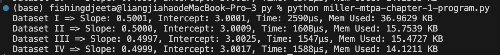
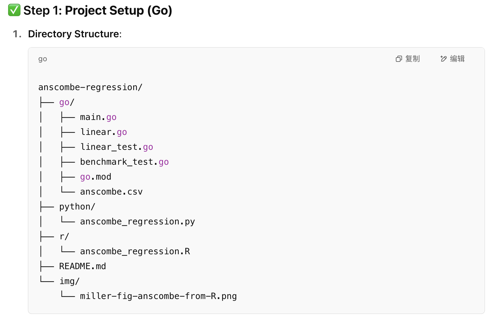

# Anscombe Quartet Linear Regression Benchmark

## 📊 Overview

This project compares the performance and accuracy of simple linear regression using **Go**, **Python**, and **R** on the [Anscombe Quartet](https://en.wikipedia.org/wiki/Anscombe%27s_quartet). The goal is to evaluate whether a Go statistics package (specifically, [`montanaflynn/stats`](https://github.com/montanaflynn/stats)) can produce regression results comparable to those from Python and R — and to benchmark their respective runtime and memory usage.

---

## 🧪 Objective

- Validate correctness of slope and intercept from Go regression
- Compare regression results from Go, Python, and R
- Benchmark CPU time and memory usage for each language
- Demonstrate Go’s potential for backend analytical tasks

---

## 🗂️ Project Structure
s

# How to Run

## Go
cd go 
go run . 
go test -v 
go test -bench=. -benchmem

### Eample and Result

## Python

cd python 
python3 miller-mtpa-chapter-1-program.py

### Eample and Result

## R

cd r 
Rscript miller-mtpa-chapter-1-program.R

### Eample and Result

## References
Anscombe, F. J. (1973). Graphs in statistical analysis. The American Statistician, 27(1), 17–21.

Miller, T. W. (2015). Modeling Techniques in Predictive Analytics.

Bates & LaNou (2023), Bodner (2024) — Go Testing References

-----------------------------------------------------------------------

# AI-Assisted and AI-Generated Programming Evaluation

## Tools Used
For AI-generated code, Automated code generation, AI-assisted programming using
- GitHub Copilot (https://github.com/features/copilot)
- ChatGPT-4o (https://chat.openai.com/)

# AI usage Examples

[Click here to view the ChatGPT dialog (PDF)](pdf/conversation.pdf)

## AI-generated code && AI-assisted programming using ChatGPT
## Prompt
The main part of this assignment was done using ChatGPT-4o. The first step is telling the AI what tasks to complete. To achieve that, I added all the assignment requirements as the base materials. For the instruction prompt, I wish to let the mode "guide me to finish the assignment", and highlight key sections that could largely affect the coding style or options such as include testing, and using montanaflynn.

## Response
As the result, AI provided us with step by step instruction to finish the project. For instance:
There's a clear directory structure showing all file required:

Instructions to initialize the Go module:

As well as the code for the files listed in the previous directory structure:

However, AI is not perfect. In my cases, we didn't get the main.go file. We can simply fixing this by telling the AI to add the file, or guide the AI to inspect whether a file is required:

## AI-assisted programming - Debugging
ChatGPT has some ability to debugging. For example, one problem I faced during testing was the AI failed to put the entire dataset to calcuate the slope and the intercept. This leads a mismatch of the expected result and the actual result. Assume we didn't notice this problem and provide the testing output to ChatGPT:

It is obvious that the AI noticed the problem. The reply includes many fixing options, such as:

And we can fix the code and pass the test easily by replcing the entire testing block.

## AI-assisted programming - Code Revising
ChatGPT can also assist us to revising the code. For instance, the previou version of code didn't show the memory usage of running the regression. We can telling the AI to modify the code from the previous section:

And the AI will provide the updataed code:

And now running the code will show the memory usage as we expected:

## AI-assisted programming - Multi-language support
ChatGPT support multiple languages. You can also asking questions with another language:

## Automated code generation && AI-assisted programming using Copilot
Copilot is another tool used in this assignment. This tool has been integrated into the compiler, allowing users to interact naturally with it for coding or debugging. In this project, I used Copliot to generate another version of the LinearRegression function. In the chat box on the right of VSCode, we can directly type our prompts. The result includes the entire function with a specific explanation:

## Automated code generation && AI-assisted programming - Debugging
Recall that when an error occurs in the program that affects its operation, the compiler will indicate the location of the error with a red underline. In our example, the red line indicates that we declared the LinearRegression function twice.

In the current version os VScode, Copilot can be used to fix some of those problems. The prompt will be generated automatically after we click 'quick fix' and the Copilot will fix the bug for us.

## Summary and Recommendation

This project evaluated three approaches to software development using AI tools:

### 1. **AI-Assisted Programming** (e.g., GitHub Copilot, ChatGPT debugging)
- AI tools were used interactively to revise functions, fix bugs, and complete partial code segments.
- GitHub Copilot provided inline code suggestions within VS Code that were context-aware, accurate, and productive.
- ChatGPT was used for higher-level logic corrections, such as helping identify a test failure due to incomplete datasets.

**Impact**: Reduced debugging time significantly; enabled fast prototyping.

---

### 2. **AI-Generated Code** (e.g., full Go functions from ChatGPT)
- ChatGPT-4o generated entire working versions of `LinearRegression` and project structure.
- The responses were generally valid and idiomatic, with occasional minor flaws (e.g., missing files, incorrect assumptions).
- Prompt engineering was necessary to refine and correct the generated output.

**Impact**: Good for bootstrapping a project or understanding structural design, but not yet fully reliable without developer oversight.

---

### 3. **Automated Code Generation** (Copilot one-click fixes and completions)
- Copilot was able to auto-complete function definitions, suggest standard library usage, and fix syntax errors via "Quick Fix".
- Particularly effective at filling in repetitive or boilerplate code.

**Impact**: Reduced the need for junior developers to write standard code manually, speeding up development cycles.

---

## Possibilities for Reducing Programming Workload

By integrating AI-assisted programming tools such as GitHub Copilot and ChatGPT into the daily development workflow, the startup has significant opportunities to reduce programming workload and improve efficiency. For routine tasks such as backend service logic, regression implementation, and data processing, AI tools can provide boilerplate code, detect logical inconsistencies, and accelerate testing. Based on my partise, such integration could lead to a 20% to 40% reduction in total development effort for common engineering tasks. Junior developers in particular benefit from pairing with tools like Copilot, which offers contextual code suggestions, syntax completions, and inline documentation. Meanwhile, large language models (LLMs) like ChatGPT are especially helpful in debugging, identifying issues in test logic, generating test cases, and transforming vague problem descriptions into implementable solutions. However, these benefits come with limitations. LLMs may "hallucinate" or generate incorrect code, misinterpret domain-specific logic, or make assumptions that do not align with project constraints. Therefore, human oversight is essential. The best use of AI lies in augmenting human developers, not replacing them outright.

---

## Recommendation on Staffing and Automation

Given the above analysis, it is recommended that the company adopt a hybrid staffing model. The core engineering team should consist of a small group of experienced Go engineers, who will be responsible for system architecture, code review, and final validation. Their expertise is vital for maintaining security, reliability, and scalability, especially when integrating AI-generated code. Meanwhile, the number of junior-level developers can be reduced or restructured, with a focus on equipping existing junior or mid-level developers with AI-powered tools like GitHub Copilot and ChatGPT. This enables less experienced developers to contribute meaningfully to the codebase with AI support, boosting productivity while lowering overall labor costs. In addition, the company should formally introduce AI-assisted workflows into its software development lifecycle (SDLC), using LLMs to assist in generating unit tests, documentation, and function scaffolds. Regular monitoring of code quality, test coverage, and technical debt should be enforced to ensure that automation does not lead to long-term maintainability issues.
